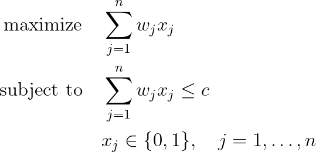

# Subset Sum Problem

## Problem formulation

Given a set $N = \lbrace 1,\ldots, n \rbrace$ of $n$ items with positive integer weights $w_1,\ldots, w_n$ and
a capacity $c$, the subset sum problem (SSP) is to find a subset of $N$ such that the
corresponding total weight is maximized without exceeding the capacity $c$.

The resulting optimization problem is known as the **subset sum problem** because
we are looking for a subset of the values $w_j$ with the sum being as close as possible
to, but not exceeding the given target value $c$.

The subset sum problem is the knapsack problem with $p_j = w_j$. 
Although subset sum problem is a special case of knapsack problem it is still NP-hard.

## Mathematical formulation

A subset sum problem can be formulated as a solution of the following linear integer program:

## Assumptions on the Input Data

We will assume that assumptions defined for knapsack problem also hold for subset sum problem. 
This means that:
+ every item $j$ fits into the knapsack, i.e. $w_j \leq c$ for all $j = 1, \ldots, n$.
+ the overall weight sum of the items exceeds $c$, i.e. $\sum_{j=1}^n w_j > c$. 
+ without loss of generality we assume that all weights are positive, i.e. $w_j > 0$ for all $j = 1, \ldots, n$.

## Subset Sum Problem as a decision problem

Subset Sum Problem formulated as a decision problem asks whether there exists a subset of $N$
such that the corresponding weights add up exactly to the capacity $c$. To distinguish 
it from the optimization problem we denote it as SSP-DECISION. 
The decision problem is of particular interest in cryptography since
SSP-DECISION with unique solutions corresponds to a secret message to be transmitted.

## References
- Knapsack Problems, H. Kellerer, U. Pferschy, D. Pisinger, 2004, [DOI](https://doi.org/10.1007/978-3-540-24777-7)

