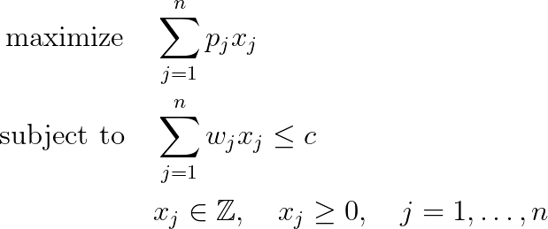

# Unbounded Knapsack Problem (UKP)

## Problem formulation

Right from the beginning of research on the knapsack problem in the early sixties
separate considerations were devoted to problems where a number of **identical copies**
of every item are given or even an unlimited amount of each item is available.
The corresponding problems are known as the **bounded knapsack problem** and **unbounded knapsack problem**, respectively.
This article is devoted to the unbounded case.

The availability of an unlimited number of copies for every item type leads to phenomena which are quite different from the bounded knapsack problem.
Although there is a natural bound of how many copies of any item type can fit into
a knapsack the structure of the problem is in several aspects not the same as for
the case with a prespecified bound.

## Mathematical formulation

A set of **item types** $N = \lbrace 1, \ldots, n \rbrace$ is given where all items of type $j$ have
profit $p_j > 0$ and weight $w_j > 0$. There is an unlimited supply of identical copies of every item type $j$ available.
The corresponding integer programming formulation of the bounded knapsack problem is given as follows.

## Application

Selecting an arbitrary number of copies from resources with unlimited but integer
availability occurs in many practical decision scenarios. Applications are usually
closely related to the case of Bounded Knapsack Problem.

## References
+  H. Kellerer, U. Pferschy, D. Pisinger, Knapsack Problems, 2004, [DOI](https://doi.org/10.1007/978-3-540-24777-7)
