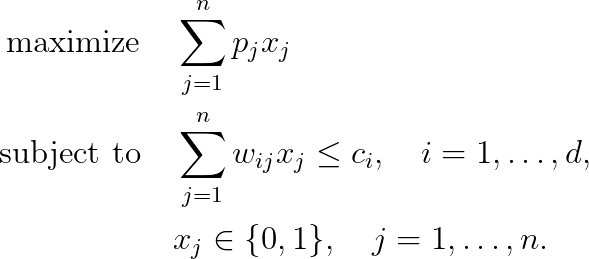

# d-Dimensional Knapsack Problem (d-KP)


## Problem formulation

In the generalizations of the basic knapsack problem we will add additional constraints to the single weight constraint thus
attaining the multidimensional knapsack problem. Many real world applications
in the selection and packing area require more than a single constraint.


The d-dimesional knapsack problem can be formally defined as follows: We are given an
instance of the knapsack problem with item set $N:= \lbrace 1,\ldots,n \rbrace$, consisting of $n$ items $j$ with profit
$p_j$ and weight $w_{ij}$, and the capacity value $c_i$ for $i = \lbrace, \ldots, d \rbrace$. Then the objective is to select a subset of $N$ such
that the total profit of the selected items is maximized and the total weight does not
exceed $c_i$.

Note that the terminology for (d-KP) is not completely unique in the literature.
Beside the occurrence of hyphens confusion arises sometimes between the terms
**multiconstraint knapsack**, **multiple knapsack** and **multidimensional knapsack**. It seems
that most authors have accepted the latter name as a general term for (d-KP) and
reserving multiple to represent the fact that an item can be put into one of several
knapsacks, which is a completely different problem!


## Mathematical formulation

The resulting generalization of knapsack problem to the d-dimensional knapsack problem is defined as follows.




This problem can be seen as a knapsack problem with a collection of different
resource constraints or one constraint consisting of a multidimensional attribute.


## Assumptions on the Input Data

It is assumed that all $p_j$, $w_{ij}$ and $c_i$ are positive integer values. It
is allowed that $w_{ij }= 0$ for some $i, j$, as long as $\sum_{i=1}^d w_{ij} \geq 1$ holds for all items
$j = 1,\ldots,n$. To guarantee that an item can be packed at all we assume
```math
w_{ij} \leq c+i \quad j = 1,\ldots,n, \quad i = 1, \ldots, d.
```
To avoid trivial constraints it is assumed
```math
\sum_{j=1}^n w_{ij} \geq c_i, \quad i = 1, \ldots, d.
```


## Application

Selecting an arbitrary number of copies from resources with unlimited but integer
availability occurs in many practical decision scenarios. Applications are usually
closely related to the case of Bounded Knapsack Problem.


## References
+  H. Kellerer, U. Pferschy, D. Pisinger, Knapsack Problems, 2004, [DOI](https://doi.org/10.1007/978-3-540-24777-7)
