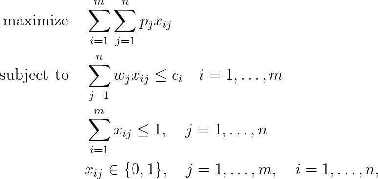

# Multiple Knapsack Problem (MKP)


## Problem formulation

In the multiple knapsack problem we are given a set of items $N := \lbrace 1, \ldots , n \rbrace$
with profits $p_j$ and weights $w_j, j = 1, \ldots ,n$ and a set of knapsacks $M:= \lbrace 1, \ldots ,m \rbrace$
with positive capacities $c_i, i = 1, \ldots , m$. We call a subset $\hat{N} \subseteq N$ feasible if the items
of $\hat{N}$ can be assigned to the knapsacks without exceeding the capacities, i.e. if $\hat{N}$ can
be partitioned into $m$ disjoint sets $N_i$, such that $w(N_i) \leq c_i i = 1, \ldots, m$. The objective
is to select a feasible subset $N$, such that the total profit of $N$ is maximized.


## Mathematical formulation

The mathematical programming formulation of this multiple knapsack problem is given by



Constraint $\sum_{i=1}^m x_{ij} \leq 1, j = 1, \ldots, n$
guarantees that every item is put at most into one plane. If the
capacities of the planes are identical we can easily simplify the above model by
introducing a capacity $c$ for all planes.


## Applications

Interesting variant of the cargo problem arises
if we consider a very busy flight route, e.g. Frankfurt - New York,
which is flown by several planes every day. In this case the dispatcher has to decide
on the loading of a number of planes in parallel, i.e. it has to be decided whether to
accept a particular transportation request and in the positive case on which plane to
put the corresponding package. The concepts of profit, weight and capacity remain
unchanged. This can be formulated by introducing a binary decision variable for
every combination of a package with a plane. If there are $n$ items on the list of
transportation requests and $m$ planes available on this route we use $nm$ binary variables
$x_{ij}$ for $i = 1, \ldots, m$ and $j = 1, \ldots , n$ with
```math
x_{ij} =
\begin{cases}
1 &  \text{if item j is put into plane i}, \\
0 &  \text{otherwise}.
\end{cases}
```


## References
- Knapsack Problems, H. Kellerer, U. Pferschy, D. Pisinger, 2004, [DOI](https://doi.org/10.1007/978-3-540-24777-7)


