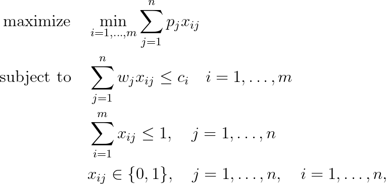

# Bottleneck Multiple Subset Sum Problem (B-MSSP)

## Mathematical formulation

The mathematical programming formulation of this Bottleneck Multiple Subset Sum Problem is given by

## References
- Knapsack Problems, H. Kellerer, U. Pferschy, D. Pisinger, 2004, [DOI](https://doi.org/10.1007/978-3-540-24777-7)

