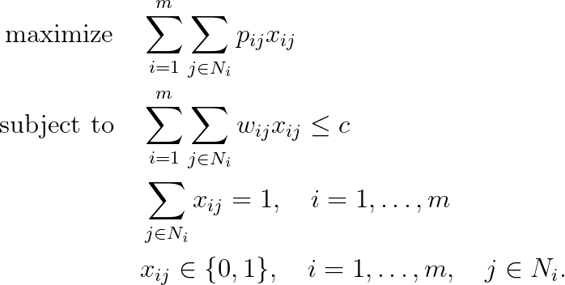

# Multiple-Choice Knapsack Problem (MCKP)

## Problem formulation

The multiple-choice knapsack problem is a generalization of the ordinary
knapsack problem, where the set of items is partitioned into classes. The binary
choice of taking an item is replaced by the selection of exactly one item out of each
class of items.

In order to define the problem formally, consider $m$ mutually disjoint classes
$N_1, \ldots ,N_m$ of $items$ to be packed into a knapsack of capacity $c$. Each item $j \in N_i$
has a profit $p_{ij}$ and a weight $w_{ij}$, and the problem is to choose exactly one item from
each class such that the profit sum is maximized without exceeding the capacity $c$ in
the corresponding weight sum. If we introduce the binary variables $x_{ij}$ which take
on value $1$ if and only if item $j$ is chosen in class $N_i$, the problem is formulated as:

## Remarks

+ If $p_{ij} = w_{ij}$ in all classes $N_i, i = 1, \ldots , m$, then the problem may be seen as a
**multiple-choice subset sum problem**. In this problem we have $m$ classes, each class
$N_i$ containing weights $w_{i1}, \ldots , w_{i n_i}$.

## References
+ U. Pferschy, D. Pisinger, **Knapsack Problems**, 2004, [DOI](https://doi.org/10.1007/978-3-540-24777-7)

