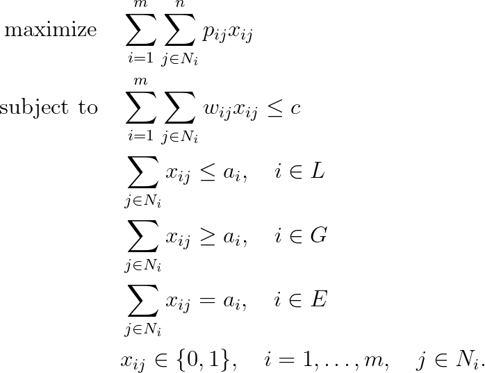

# Generalized Multiple-Choice Knapsack Problem (GMCKP)

## Problem formulation

In order to define the problem formally, consider $m$ mutually disjoint classes
$N_1, \ldots ,N_m$ of $items$ to be packed into a knapsack of capacity $c$. Each item $j \in N_i$
has a profit $p_{ij}$ and a weight $w_{ij}$, and the problem is to choose exactly one item from
each class such that the profit sum is maximized without exceeding the capacity $c$ in
the corresponding weight sum. If we introduce the binary variables $x_{ij}$ which take
on value $1$ if and only if item $j$ is chosen in class $N_i$, the problem is formulated as:

The sets $L$, $G$, $E$ form a partitioning of $\lbrace 1, \ldots , m \rbrace$. All coefficients $p_{ij}$, $w_{ij}$, $a_i$ and $c$
are nonnegative, and the classes $N_1 , \ldots , N_m$ are mutually disjoint.

## Remarks

The interesting property of (GMCKP) is that it contains all the weakly NP-hard
knapsack problems as a special case, including the **subset sum problem**, **bounded
knapsack problem**, and **multiple-choice knapsack problem**.

## References
- Knapsack Problems, H. Kellerer, U. Pferschy, D. Pisinger, 2004, [DOI](https://doi.org/10.1007/978-3-540-24777-7)

