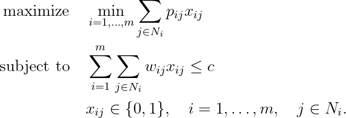

# Knapsack Sharing Problem

## Problem formulation

The knapsack sharing problem which in the binary form may
be described as follows: Given a set $N = \lbrace 1, \ldots , n \rbrace$ of items, each item $j \in N$
belonging to exactly one of the m disjoint classes $N_1, \ldots , N_m$ with $\cup_{i=1}^m N_i = N$. Item
$j \in N_i$ has an associated profit $p_{ij}$ and weight $w_{ij}$. The objective is to pack a subset
of the items into a knapsack of capacity $c$ such that the minimum of the profit sums
in the classes is maximized. Using binary variables $x_{ij}$ to denote whether item $j$ was
chosen in class $N_i$, we may formulate the knapsack sharing problem as:

## Remarks

## References
- Knapsack Problems, H. Kellerer, U. Pferschy, D. Pisinger, 2004, [DOI](https://doi.org/10.1007/978-3-540-24777-7)

