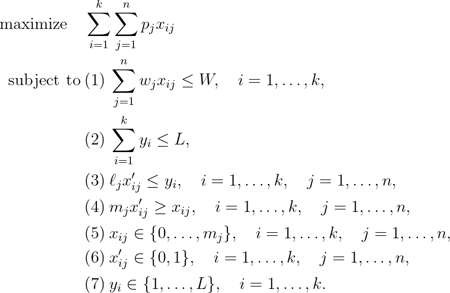

# Two-Dimensional Two-Stage Cutting Problem

## Problem formulation

The main ingredients of a two-dimensional cutting problem are a given set of rectangular
pieces and a large rectangular sheet or stock unit which should be cut into
pieces out of the given set. Industrial applications of cutting problems deal with
various materials such as steel, wood and glass. In most cases the cutting technology
permits only so-called guillotine cuts, i.e. every cut of the large sheet has to be made
orthogonal to one edge and straight across the sheet from one side to the opposite
side without stopping. Moreover, usually only axis parallel cuts are allowed.

It depends on the raw material whether it is allowed to choose the orientation of
the pieces when they are cut from the large sheet. If the pieces have a given surface
structure such as the grain of wood or the structure of tinted glass, every piece
may have a fixed orientation prescribing a correspondence of the axes of the pieces
with axes of the large sheet. In the case of homogeneous material such as steel or
chipboard the pieces may be rotated by 90 degrees.

A further restriction caused either by the cutting technology or the desired ease
of manipulation is the requirement to perform cuts in **stages**. This means that in
a first stage the large sheet is cut vertically into a number of **strips**. In a second
stage each strip is further cut horizontally into rectangular pieces. Further stages
my follow to continue the cutting process but many real-world cases are restricted
to **two-stage cutting patterns**. Since the pieces resulting from a two-stage cutting
procedure may have larger dimensions than the required pieces, excess material
must be removed during a final processing step called **trimming**.

This section deals with optimal utilization of one large rectangular sheet which
should be cut into rectangular pieces.
Each piece of the given set has an associated profit and the objective is to select
those pieces for cutting which yield the maximum total profit. Since each piece may
be produced arbitrarily many times the resulting two-dimensional cutting problem
is a kind of an unbounded knapsack problem in two dimensions. In this section we
assume that only two-stage guillotine cuts are performed and no rotations are
allowed.

In order to formulate the problem as an integer programming model, we need some
definitions: The large sheet has dimension $L \times W$. There are $n$ different piece types,
each having dimension $\ell_j \times w_j$ which can be produced in unbounded numbers. The
pieces have an associated profit $p_j$ reflecting some demand prices. For the
integer programming formulation an upper bound $k$ for the number of vertical strips
is required. A trivial bound can be given by $k = \lfloor L / \ell_{\text{min}} \rfloor$.
Now the lengths of these
vertical strips can be represented by variables $y_i$ for $i = 1, \ldots , k$. We use the decision
variable $x_{ij}$ to represent that item $j$ is cut $x_{ij}$ times from strip $i$. The decision variable
$x_{ij}'$ says that at least one item $j$ has been cut from strip $i$. Moreover, let $m_j$ denote the
maximum number of pieces of type $j$ which can be cut from the sheet. The integer-programming model now becomes:

In the above equation:
+ The constraints (1) say that no strip may exceed the width of the sheet.
+ The constraint (2) ensures that the sum of strip lengths should be within the sheet length.
+ The constraints (3) demand that each item $j$ chosen for strip $i$ should
have length $\ell_j$ not greater than the length $y_i$ of the strip.
+ The constraint (4) ensures that if $x_{ij} > 0$ then $x_{ij}' = 1$.

## Remarks

A further generalization of the problem would be to allow rotation of the items by
90 degrees. In this case we may simply extend the problem to $2n$ items, item $n + j$
being item $j$ rotated. Since an infinite amount of both items is available, the above
recursion may be applied without changes.

## References
+ U. Pferschy, D. Pisinger, **Knapsack Problems**, 2004, [DOI](https://doi.org/10.1007/978-3-540-24777-7)

