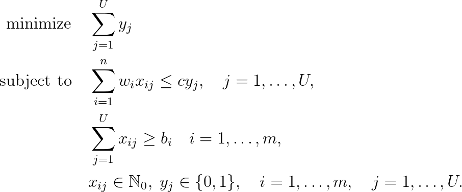
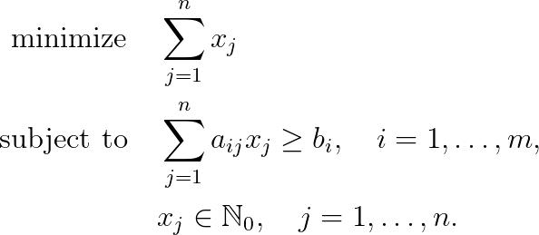

# Cutting Stock Problem

## Problem formulation

In the cutting stock
problem we are given an unlimited number of bins (e.g. base rolls of metal) of length
$c$ and $m$ different types of items (rolls). At least $b_i$ rolls of length $w_i, i = 1, \ldots , m$
have to be cut of the base rolls. The objective is minimize the the number of bins
used, i.e. to minimize the wasted material. In the special case of $b_i = 1, i = 1, \ldots , m$,
i.e. there is only a demand for one item per type, the problem can be recognized as
the ordinary **bin packing problem**.


Assume that $U$ is an upper bound on the number of bins needed. Moreover, the
variable $x_{ij}$ denotes how many times item type $i$ is cut of bin $j$ and the decision variable
$y_j$ denotes whether bin $j$ is used for cutting or not. The cutting stock problem may
then be formulated as a follows:




Unfortunately, the upper bounds obtained by solving the LP-relaxation of the above formulation
may be quite loose and the problem contains many symmetric solutions (see Vance).
Thus, the above problem is extremely difficult for
general mixed integer programming solvers and this model is not used in practice.

A different formulation of the cutting stock problem is due to Gilmore and Gomory.
Instead of assigning an item to the bin it is cut of, we consider the
set all possible cutting patterns. A vector $\alpha \in \lbrace O, l \rbrace^m$ represents a cutting pattern if
we have
```math
\sum_{i=1}^m w_i \alpha_i \leq c,
```
where $\alpha_i$ denotes how often item type $i$ is cut in the corresponding pattern. Let
the matrix $A = (a_{ij})$ be an $m \times n$ matrix which consists of the $n$ possible packing
patterns $j$ of a single bin, i.e. each column $j$ in matrix $A$ should satisfy the above condition. Then we
may formulate the cutting stock problem as choosing a subset of the columns (i.e.
packing patterns) such that the demands are satisfied. If we introduce the decision
variable $x_j$ to denote how many times a packing pattern $j$ is used, we get the model




## Remarks

The problem reflects situations where items belong to a number of owners, and each owner wishes to
maximize the total profit of his own items in the shared knapsack. The model maximizes
the minimum level of the profit sum that can be guaranteed to all owners.


## References
+ Knapsack Problems, H. Kellerer, U. Pferschy, D. Pisinger, 2004, [DOI](https://doi.org/10.1007/978-3-540-24777-7)

+ P.H. Vance, C. Barnhart, E.L. Johnson, and G.L. Nernhauser. Solving binary cutting
stock problems by column generation and branch-and-bound. Computational
Optimization and Applications, 3:111-130, 1994. [DOI](https://doi.org/10.1007/BF01300970)

+ P.C. Gilmore and R.E. Gomory. A linear programming approach to the cutting stock
problem. Operations Research, 9:849-859.1961. [DOI](https://doi.org/10.1287/opre.9.6.849)

+ P.C. Gilmore and R.E. Gomory. A linear programming approach to the cutting stock
problem, part II. Operations Research, 11:863-888, 1963. [DOI](https://doi.org/10.1287/opre.11.6.863)


