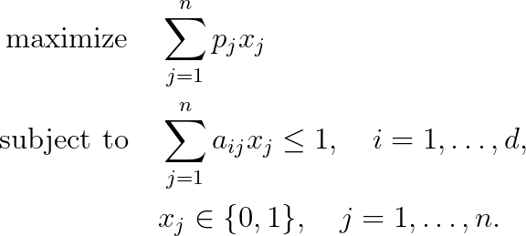

# Combinatorial Auctions Problem

## Problem formulation

In many cases the price which a bidder offers for some good may depend on the
other goods he buys. Thus, it seems advantageous that prices are offered not for
single goods but for sets of goods (items) to be sold. The corresponding type of
auction is called **combinatorial auction**.

A combinatorial auction is of specific interest if some goods are considered to be
complementary for the bidder, i.e. the value of a set of items is higher than the sum
of the values of the single items. As an example consider a technical equipment
consisting of several parts which has a higher value if bought as a whole bundle.

There are several ways of **winner determination**, i.e. to determine those sets of bids
which are accepted by the auctioneer. One possible way is defined as the
**combinatorial auction problem**: An auctioneer gets price offers for sets of items and his goal
is to allocate the items to the bidders such that the turnover, reflecting his personal
revenue, is maximized.

Formally, in the **combinatorial auction problem** we have given a set $N = \lbrace 1, \ldots ,n \rbrace$
of $n$ bids and a set $D = \lbrace 1, \ldots ,d \rbrace$ of $d$ goods. A bid $j$ is defined as a pair $(A_j,p_j)$
where $A_j$ denotes a subset of the set of goods $D$ and $p_j$ is the price offer for $A_j$. The
auctioneer has to select a set of disjoint sets $A_j$ with maximal total price. Set $a_{ij} := 1$
if good $i$ is contained in bid $j$, i.e. $i \in A_j$, otherwise $aij := 0$. Let the binary variable
$x_j$ determine whether bid $j$ is selected by the auctioneer or not. Then, the integer
programming formulation of the combinatorial auction problem reads as follows:

This combinatorial auction model is also called a **single-unit combinatorial auction**,
because there is exactly one copy of each item available. Since the problem is in
principle equivalent to a **weighted set packing problem**, it is strongly NP-hard.

## References
+ Knapsack Problems, H. Kellerer, U. Pferschy, D. Pisinger, 2004, [DOI](https://doi.org/10.1007/978-3-540-24777-7)

