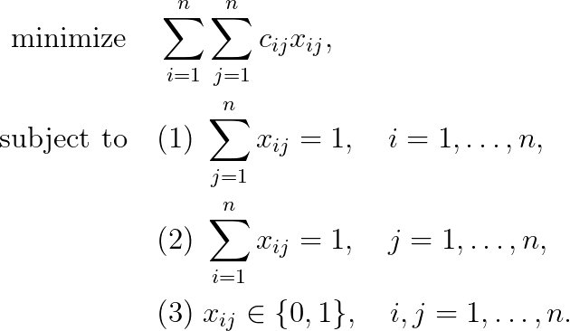

# Linear Sum Assignment Problem

## Problem formulation

Given an $n \times n$ cost matrix $C = (c_{ij})$, where $c_{ij}$ measures the cost
of assigning $i$ to $j$, we ask for an assignment with minimum total cost.

## Remarks

## References
- R. Burkard, M. Dell’Amico, S. Martello "Assignment Problems", 2009, [DOI](https://doi.org/10.1137/1.9781611972238)

