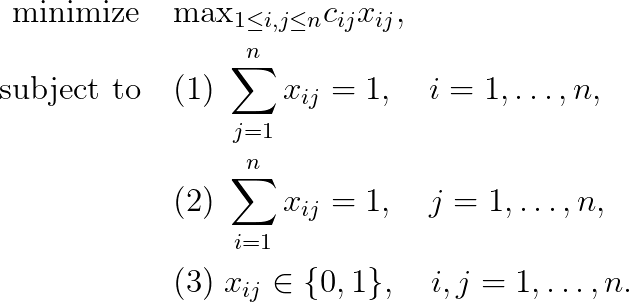

# Linear Bottleneck Assignment Problem

## Problem formulation

**Linear bottleneck assignment problems (LBAP)** were introduced by Fulkerson, Glicksberg, and Gross
and occur, e.g., in connection with assigning jobs to parallel machines so as
to minimize the latest completion time.

Suppose that $n$ jobs are to be assigned to $n$ machines (or workers) in the best
possible way. Let us assume that machine $j$ needs $c_{ij}$ time units in order to process job
$i$. We want to minimize the total completion time. If we assume
that the machines work in parallel, we have to minimize the maximum value of elapsed time.
The goal is to assign the jobs such that the latest completion time
is minimized. The problem is formulated as follows:

The first set of equations (1) says that every row of a matrix $X = (x_{ij})$ sums to $1$. The
second set of equations (2) says that every column of a matrix $X$ has a sum of $1$.
Finally, (3) says that a matrix $X$ has only the entries $0$ and $1$. In particular,
a matrix $X$ has exactly $n$ 1-entries, one in every row and in every column. The
relations (1)–(3) are called assignment constraints and the matrix $X$ is called the permutation matrix.

## Remarks
+ The optimum value of the LBAP is taken by one of the cost coefficients $c_{ij}$.
+ The optimal solution depends only on the relative order of the cost coefficients and not on their numerical value.

## References
+ R. Burkard, M. Dell’Amico, S. Martello, **Assignment Problems**, 2009, [DOI](https://doi.org/10.1137/1.9781611972238)
+ D.R. Fulkerson, I. Glicksberg, O. Gross. A production line assignment problem. Tech. Rep. RM-1102, The Rand Corporation, Santa Monica, CA, 1953, [DOI](https://www.rand.org/pubs/research_memoranda/RM1102.html)
