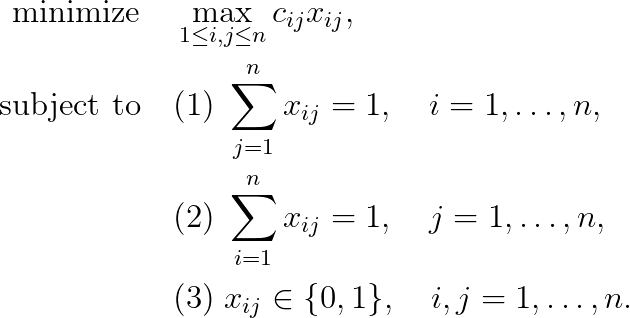

# Linear Bottleneck Assignment Problem

## Problem formulation

The problem is formulated as follows:

The first set of equations (1) says that every row of a matrix $X = (x_{ij})$ sums to $1$. The
second set of equations (2) says that every column of a matrix $X$ has a sum of $1$.
Finally, (3) says that a matrix $X$ has only the entries $0$ and $1$. In particular,
a matrix $X$ has exactly $n$ 1-entries, one in every row and in every column. The
relations (1)–(3) are called assignment constraints and the matrix $X$ is called the permutation matrix.

## References
+ R. Burkard, M. Dell’Amico, S. Martello, **Assignment Problems**, 2009, [DOI](https://doi.org/10.1137/1.9781611972238)

