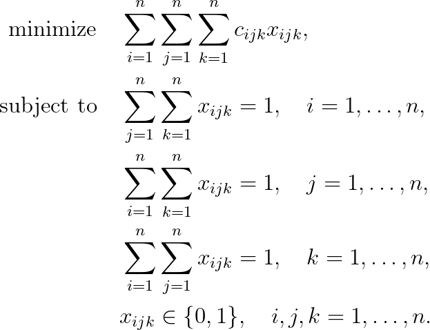

# Axial 3-index Assignment Problem

## Problem formulation

Multi-index assignment problems were introduced by Pierskalla in 1968 as a natural
extension of linear assignment problems. For a long time only 3-index assignment problems
have been considered, while in recent years problems with more than 3 indices have been
investigated, mainly in the context of multi-target tracking and data association problems by Poore in 1994.

The axial 3-index assignment problem (axial 3AP) can be stated in the following way. Let
$n^3$ cost coefficients $c_{ijk}$ for $i,j,k = 1, \ldots , n$ be given.
We can write this problem as an integer linear program:

## References
+ R. Burkard, M. Dell’Amico, S. Martello, **Assignment Problems**, 2009, [DOI](https://doi.org/10.1137/1.9781611972238)
+ W.P. Pierskalla. The multidimensional assignment problem. Oper. Res., 16:422–431, 1968, [DOI](https://doi.org/10.1287/opre.16.2.422)
+ A.B. Poore. Multidimensional assignment formulation of data association problems arising from multitarget and multisensor tracking. Computational Opt. Appl., 3:27–57, 1994, [DOI](https://doi.org/10.1007/978-1-4757-3155-2_2)
