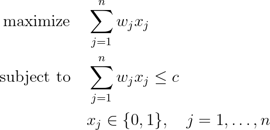
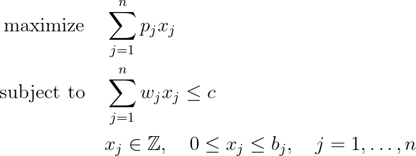
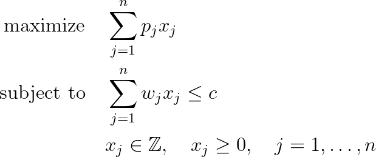
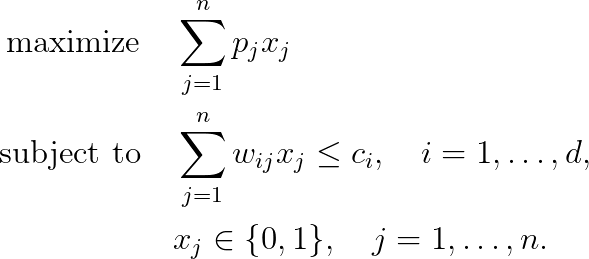
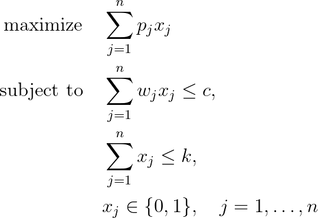
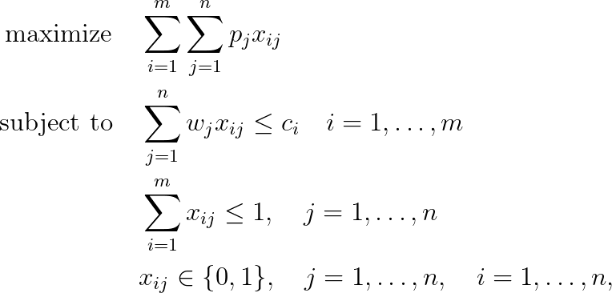
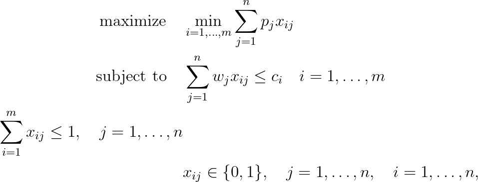

# Combinatorial optimization problems

Formulation of combinatorial optimization problems in AMPL language

## Knapsack Problem, [more](./01-knapsack-problem/README.md)

## Subset Sum Problem, [more](./02-subset-sum-problem/README.md)

## Bounded Knapsack Problem, [more](./03-bounded-knapsack-problem/README.md)

## Unbounded Knapsack Problem, [more](./04-unbounded-knapsack-problem/README.md)

## d-Dimensional Knapsack Problem, [more](./05-d-dimensional-knapsack-problem/README.md)

## k-Item Knapsack Problem, [more](./06-k-item-knapsack-problem/README.md)

## Multiple Knapsack Problem, [more](./07-multiple-knapsack-problem/README.md)

## Bottleneck Multiple Subset Sum Problem, [more](./08-bottleneck-multiple-subset-sum-problem/README.md)

## Additional information

- LaTeX eqaution generated by [Equation Editor for online mathematics](https://editor.codecogs.com/)

